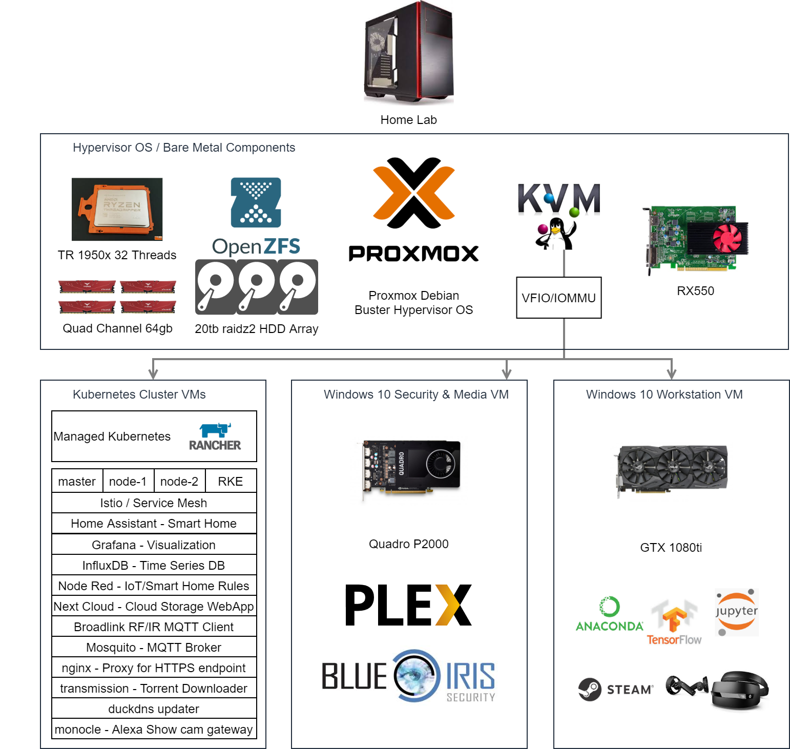

# my-home-lab

this is my home-lab, ill be describing its components so you can create the same

## Setting Up the Hardware
* [https://www.youtube.com/watch?v=niplvJzs52A&t=2313s](https://www.youtube.com/watch?v=niplvJzs52A&t=2313s)

